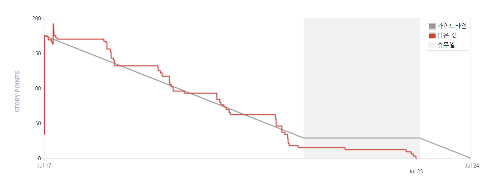

# D203

# Immerse

SSAFY 9기 공통 프로젝트

---

# 목차

1. [**서비스 소개**](#서비스-소개)
2. [**기획 배경**](#기획-배경)
3. [**기능 소개**](#s-3)
4. [**시연 영상**](#s-4)
5. [**기술 스택**](#s-5)
6. [**프로젝트 일정 및 산출물**](#s-6)
7. [**개발 멤버 및 회고**](#s-7)
8. [**트러블 슈팅**](#트러블-슈팅)
9. [**개발 중 유의사항**](#s-9)

---

<div id=s-1></div>

# 서비스 소개

> 당신이 원하는 곳 어디서나 웃고 연결하고 몰입하라!

누구나 나만의 작은 공연의 주인공이 될 수 있습니다.

- 나의 재능을 알리고 싶은 사람
- 집에서 편하게 공연을 보고 싶은 사람


<div id=s-2></div>

# 기획 배경


- 화상 콘서트 및 스탠딩 코미디의 인기


    최근 글로벌 음악 산업에서는 온라인으로 콘서트를 제공하는 추세가 높아지고 있으며, 화상 콘서트를 통해 수익을 창출하는 사례가 늘어나고 있습니다. 또한, 스탠딩 코미디 역시 온라인 플랫폼에서 성공적으로 진행되고 있습니다.

- 코로나19로 인해 우리에게 찾아 온 ‘언택트(Untact)’ 생활은 우리의 일상을 바꿈으로 인해 온라인으로 활동하는 취미활동이 늘어났다.
    
     이러한 영향으로 인하여 공연 또한 오프라인에서 온라인으로 바뀌게 되며 이에대한 수요가 증가하고 있는 추세이다.
    
- 오프라인에서 느끼는 생생함은 조금 떨어 질 수도 있지만, 컴퓨터 그래픽과 영상 기술로 인한 새로운 경험을 보여 줄 수 있다는 점에서 기대감을 느끼게 할 수 있다.


<div id=s-3></div>

# 기능 소개

- 공연 특화

    공연자 시점화면 제공, 티ㅅ 모양의 히스토리 등, 공연에 특화된 디자인과 서비스를 제공

- 관객과의 소통하는 기능

    소규모 화상 서비스와 다양한 이펙트 효과를 활용한 공연자와 관객의 소통을 제공하는 기능

- 다양한 컨텐츠

    공연 토너먼트 등 다양한 컨텐츠를 통해 자신을 알릴 수 있는 홍보 기회 제공

<div id=s-4></div>

# 시연 영상

[demo](./exec/시연_시나리오.md)

---

<div id=s-5></div>

# 기술 스택

- JAVA, Spring

- JavaScript, React

- WebRTC

**Web Real-Time Communication**은 웹 브라우저 간 별도의 소프트웨어 없이 실시간으로 마이크, 카메라 등을 사용한 커뮤니케이션을 가능하게 해주는 API입니다. 본 프로젝트는 화상 공연 기능을 구현하기 위해 `WebRTC`를 적용하였습니다.

- OpenVidu

`OpenVidu`는 `WebRTC` 연결 설정 및 관리를 돕기 위한 내부 시그널링 메커니즘을 가지고 있으며, `TURN` 서버를 활용하여 `NAT`나 방화벽과 같은 네트워크 제약을 극복하는 데 도움을 줍니다. 내부적으로 `Kurento`의 기능을 포함하지만, 더욱 추상화되어 개발자 친화적인 인터페이스를 제공합니다. 비디오 통화와 관련된 기능을 더 쉽게 구현할 수 있도록 합니다.

<div id=s-6></div>

# 프로젝트 일정 및 산출물

## 프로젝트 일정

## 프로젝트 진행

### Git Flow

형상 관리를 위해 `git`을 썼으며, 일부 팀원은 `sourcetree` 프로그램을 이용하였습니다. `master` 를 빌드 및 배포를 위한 브랜치로 하여 매일 아침 저녁 리뷰를 진행한 후 실제 작업이 이루어지는 브랜치에서 `merge`하였습니다.

### Jira

체계적인 일정 관리를 위해 `Jira`를 활용하였습니다. 매주 월요일 한 주간의 작업 내용을 백로그에 기록, 스프린트를 진행하였습니다.



### 프로젝트 산출물


<div id=s-7></div>

# 개발 멤버 및 회고

D203 모래성

|이름|역할|
|---|---|
|주재홍|팀장, BE|
|구본재|FE|
|안영기|FE|
|김현진|BE|
|장중원|BE|


<div id=s-8></div>

# 트러블 슈팅

[JPA 트러블슈팅](https://www.notion.so/JPA-180c9b1a5fff4403af0e19dd531ad24c)

[JWT 트러블슈팅](https://www.notion.so/JWT-476795e19e74458799b7a1da9c3949f3)

[swagger 트러블슈팅](https://www.notion.so/Swagger-docs-a4eb013309f440f1b07b7a4826babb30)

[React 트러블슈팅](https://www.notion.so/React-ff85c847dea548a3b9076284d95aa29c)

[Docker & 젠킨스 배포](https://www.notion.so/docker-jenkins-a45e65e285e244c5a93b6a7ce7080676)

[https 설정 문제](https://www.notion.so/https-ab8071b14de149999c29d5d9288b7820)


<div id=s-9></div>

# 개발 중 유의사항

- 개발 완료 후 삭제 예정

레포지터리 클론

```git clone https://lab.ssafy.com/wnwoghd22/d203.git```

항상 pull 부터 해주세요.

```git pull origin master```

작업은 branch 생성 후 그곳에서 진행하기!

```git switch -c [branch]```

커밋할 때는 컨벤션 지키기

```[FE][Jira 이슈 ID] 작업 내용```
```[BE][Jira 이슈 ID] 작업 내용```

MR 들어오면 코드리뷰 해주기

