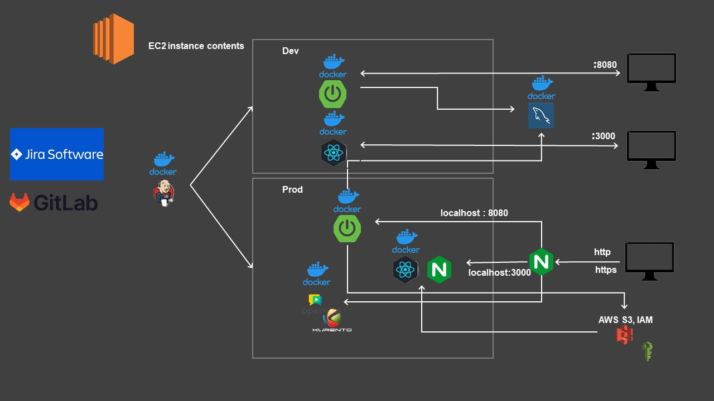
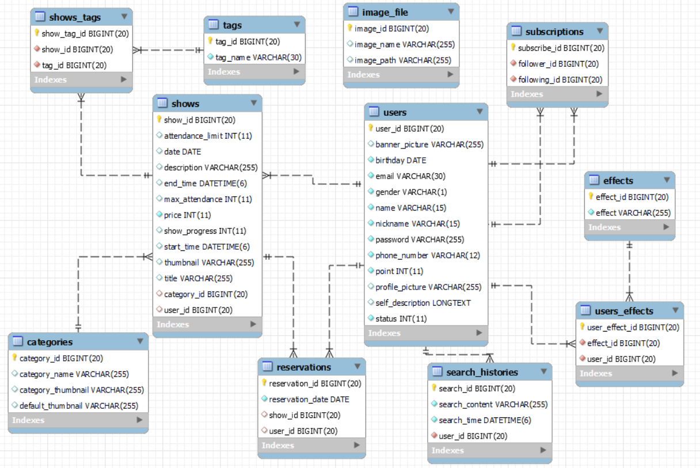

# 빌드

목차

- [빌드 정보](#빌드-정보)
- [배포 절차](#배포-절차)
    - [Docker](#docker)
    - [OpenVidu](#openvidu)
    - [NGINX](#nginx)
    - [MySQL](#mysql)
    - [Backend](#backend)
    - [Frontend](#frontend)

<div id="1"></div>

## 빌드 정보

<table>
    <tr><th>구분</th><th>기술스택</th><th>상세내용</th><th>버전</th></tr>
    <tr><td rowspan="3">공통</td><td>형상관리</td><td>git</td><td></td></tr>
    <tr><td>이슈관리</td><td>jira</td><td></td></tr>
    <tr><td>커뮤니케이션</td><td>Mattermost, Notion</td><td></td></tr>
    <tr><td rowspan="7">Backend</td><td rowspan="2">DB</td><td>MySQL</td><td>5.7.42</td></tr>
    <tr></tr>
    <tr><td>JAVA</td><td>OpenJDK</td><td>11.0.20</td></tr>
    <td>Spring</td><td>Spring boot</td><td>2.7.14</td></tr>
    <tr><td>IDE</td><td>IntelliJ</td><td>2023.2</td></tr>
    <tr><td>Build</td><td>Gradle</td><td>8.1.1</td></tr>
    <tr><td>API docs</td><td>swagger</td><td>3.0.1</td></tr>
    <tr><td rowspan="8">Frontend</td><td rowspan="2">React</td><td>React</td><td>18.2.0</td></tr>
    <tr><td>Redux</td><td>4.2.1</td></tr>
    <tr><td>WebRTC</td><td>openvidu-browser</td><td>2.28.0</td></tr>
    <tr><td>Editor</td><td>Visual Studio Code</td><td>1.80.0</td></tr>
    <tr><td>Build</td><td>vite</td><td>4.4.5</td></tr>
</table>

<div id="2"></div>

## 배포 절차

프로젝트의 배포는 Amazon EC2, ubuntu 기준으로 설명합니다. 퍼블릭 도메인이 있는 것으로 가정하고 진행합니다. 다음은 프로젝트의 구조도입니다.



<div id="docker"></div>

### Docker

모든 서비스는 도커로 빌드, 배포됩니다. 우선 EC2에 도커 엔진이 설치되어 있어야 합니다. 설치 방법은 [공식문서](https://docs.docker.com/engine/install/ubuntu/)의 절차를 그대로 따라주면 됩니다. ssh 접속 후 다음 명령어를 입력합니다.

우선 ubuntu의 apt 및 인증 프로그램을 업데이트합니다.

```bash
$ sudo apt-get update
$ sudo apt-get install ca-certificates curl gnupg

$ sudo install -m 0755 -d /etc/apt/keyrings
$ curl -fsSL https://download.docker.com/linux/ubuntu/gpg | $ sudo gpg --dearmor -o /etc/apt/keyrings/docker.gpg
$ sudo chmod a+r /etc/apt/keyrings/docker.gpg

$ echo \
  "deb [arch="$(dpkg --print-architecture)" signed-by=/etc/apt/keyrings/docker.gpg] https://download.docker.com/linux/ubuntu \
  "$(. /etc/os-release && echo "$VERSION_CODENAME")" stable" | \
  sudo tee /etc/apt/sources.list.d/docker.list > /dev/null
```

이제 docker를 설치합니다.

```bash
$ sudo apt-get install docker-ce docker-ce-cli containerd.io docker-buildx-plugin docker-compose-plugin
```

<div id="openvidu"></div>

### OpenVidu

다른 모든 서버를 배포하기 전에 `OpenVidu` 서버부터 배포하는 것을 추천합니다. 개방되어 있어야 하는 포트가 많은 관계로 다른 서비스가 배포된 상태에서 이미 배포된 서비스를 모두 정지하고 다시 작업해야 할 수 있습니다.

OpenVidu의 배포는 tutorial 페이지에 있는 것을 그대로 해주면 됩니다.

1. 우선 포트를 열어줍니다.

OpenVidu 배포를 위해 열려있어야 하는 포트는 다음과 같습니다. 또한 다른 서비스에서 사용중이어서는 안 됩니다.

- 22 TCP: SSH 연결을 위한 기본포트
- 80 TCP: 인증 방식이 `Let's Encrypt`일 때, SSL 인증키 발급을 위해 열려 있어야 합니다.
- 443 TCP: https 접속 기본 포트
- 3478 TCP+UDP: STUN/TURN 서버 포트
- 40000~57000 TCP+UDP: Kurento media 서버
- 57001~65535 TCP+UDP: TURN 서버

다음 명령어로 포트를 열어줍니다. 권한이 없을 경우 명령 앞에 sudo를 함께 입력하여 관리자 권한으로 실행합니다.

```bash
$ ufw allow 22
$ ufw allow 80
$ ufw allow 443
$ ufw allow 3478
$ ufw allow 40000:65535
```

2. OpenVidu 소스파일 받기

공식문서에서는 `/opt` 경로에서 파일을 받기를 추천합니다.

우선 관리자 권한을 얻습니다.

```bash
$ sudo su
```

경로 이동합니다.

```bash
$ cd /opt
```

다음 명령어를 입력하여 소스파일을 다운로드합니다. `2.28.0` 버전을 받습니다.

```bash
$ curl https://s3-eu-west-1.amazonaws.com/aws.openvidu.io/install_openvidu_2.28.0.sh | bash
```

3. 설정 및 실행

`/opt/.env` 파일을 열고 몆 가지 값을 넣어줍니다.

```
# 배포하려는 EC2의 퍼블릭 도메인 값을 입력합니다.
DOMAIN_OR_PUBLIC_IP=

# 시그널링 할 때 입력해야 하는 비밀번호.
# 백엔드의 기본값은 MY_SECRET입니다.
OPENVIDU_SECRET=MY_SECRET

# letsencrypt 로 인증
CERTIFICATE_TYPE=letsencrypt

# 인증 방식이 letsencrypt라면 이메일을 입력합니다.
LETSENCRYPT_EMAIL=user@example.com

# SSL 인증을 받기 전 기본 포트를 설정합니다.
HTTP_PORT=80
HTTPS_PORT=443
...
```

이제 OpenVidu를 최초 1회 실행하면 SSL 인증이 이루어집니다.

```bash
$ ./openvidu start
```

인증이 이루어지면 퍼블릭 도메인으로 접속했을 때 `OpenVidu`페이지로 들어가게 됩니다. 잘 실행되는지 확인한 후 일단 `OpenVidu`의 실행을 정지합니다.

```bash
$ ./openvidu stop
```

인증이 완료된 후에는 원하는대로 https 포트를 바꿀 수 있습니다. 백엔드의 OpenVidu 서버 주소는 4443번으로 설정되어 있으므로 다음과 같이 `.env`파일의 값을 변경합니다.

```
HTTPS_PORT=4443
...
```

다시 실행하면 4443번 포트로 변경되는 것을 확인할 수 있습니다.

<div id="nginx"></div>

### NGINX

본 프로젝트는 `nginx`를 통한 리버스 프록시가 필요합니다. EC2에서 `nginx`를 설치해 주어야 합니다.

```bash
$ sudo apt install nginx
$ sudo service nginx start
```

`nginx`로 https 접속이 가능하게 하기 위해서는 SSL 인증을 받아야 합니다. 이를 위한 인증 프로그램을 설치해야 합니다. 인증은 `certbot`을 이용, `Let's Encrypt`로 하겠습니다.

다음 명령어로 `certbot`을 설치합니다.

```bash
# snap을 이용하여 core 설치 -> snap을 최신 버전으로 유지하기 위해 설치
$ sudo snap install core

# core를 refresh 해준다.
$ sudo snap refresh core

# 기존에 잘못된 certbot이 설치되어있을 수도 있으니 삭제 해준다.
$ sudo apt remove certbot

# certbot 설치
$ sudo snap install --classic certbot

# certbot 명령을 로컬에서 실행할 수 있도록 snap의 certbot 파일을 로컬의 cerbot과 링크(연결) 시켜준다. -s 옵션은 심볼릭링크를 하겠다는 것.
$ ln -s /snap/bin/certbot /usr/bin/certbot
```

`certbot` 설치가 완료되면 nginx를 인증합니다.

```bash
$ sudo certbot --nginx
```

`certbot`이 `nginx`설정까지 자동으로 해주기 때문에 위 과정을 마친 후에는 설정 파일이 변경되어 있습니다. 리버스 프족시 설정을 위해 설정을 몇 가지 추가합니다.

```
server {

    ...

    # 통상의 모든 접근은 3000번 포트로 포트포워딩
    location / {
            proxy_pass YOUR_DOMAIN:3000;
    }

    # 백엔드 API는 /api로 접근, 8080 포트로 포워딩
    location /api {
            rewrite ^/api(.*)$ $1?$args break;
            proxy_pass YOUR_DOMAIN:8080;
    }

    ...
}
server {
    if ($host = YOUR_DOMAIN) {
        return 301 https://$host$request_uri;
    } # managed by Certbot

        listen 81 ;
        listen [::]:81 ;
    server_name YOUR_DOMAIN;
    return 404; # managed by Certbot
}                

```

모든 설정을 마쳤다면 `nginx`를 재시작합니다.

<div id="mysql"></div>

### MySQL

본 프로젝트는 MySQL로 데이터를 관리합니다. Docker에서 MySQL 컨테이너를 실행시킬 필요가 있습니다. DB의 포트 번호는 3306입니다. 백엔드에서 접근하는 DB의 이름은 `ssafy_web_db`이며, 접근에 필요한 비밀번호는 `ssafy`입니다.

```bash
sudo docker \
  run \
  --detach \
  --env MYSQL_ROOT_PASSWORD="ssafy" \
  --env MYSQL_USER="ssafy"  \
  --env MYSQL_PASSWORD="ssafy" \
  --env MYSQL_DATABASE="ssafy_web_db" \
  --name "immerse_db" \
  --publish 3306:3306 \
  mysql:5.7.42;
```

다음은 DB의 ERD입니다.



이제 백엔드와 프론트엔드 배포만 남았습니다.

<div id="backend"></div>

### Backend

우선 프로젝트를 clone 받습니다. 이후 클론받은 작업경로로 이동합니다.

백엔드 파일의 빌드를 위해서는 `AWS S3`의 인증키가 필요합니다. 이 값은 `application.properties` 파일에 들어있고, 이 값들은 `jasypt`에 의해 암호화되어 있습니다.

Dockerfile에 필요한 값들은 모두 설정되어 있습니다. 빌드할 때는 다음 명령어만 입력하면 간단히 빌드됩니다.

```bash
$ cd back-end/immerse # beck end 경로 이동
$ chmod +x ./gradlew # gradlew 실행 권한 부여

$ ./gradlew clean
$ ./gradlew build -x test # jar file 빌드

$ docker rmi -f immerse_back || exit 0 # 기존 이미지 파일 삭제
$ docker build --build-arg "JASYPT_SECRET={YOUR_S3_SECRET_KEY}" -t immerse_back . # 이미지 파일 빌드
```

`gradle` 빌드 시 `-x test` 옵션으로 통합테스트는 생략합니다. properties 파일의 설정 값들을 테스트 시 가져오지 못하고, 따라서 필요한 Bean의 생성 시 문제가 생깁니다. 이 부분을 건너뛰어도 실행에는 크게 문제가 없습니다.

도커 파일은 다음과 같습니다.

```dockerfile
FROM openjdk:11-jdk-slim

ARG JASYPT_SECRET
ENV JASYPT_ENV=$JASYPT_SECRET

ARG JAR_FILE=build/libs/*.jar
COPY ${JAR_FILE} app.jar
ENTRYPOINT java -jar -DjasyptSecret=$JASYPT_ENV /app.jar
```

`JASYPT` 복호화를 위한 값은 빌드 시가 아닌 실행 시 받습니다. 환경변수로 받게 한 후 실행합니다. 다음 명령어로 실행합니다.

```bash
$ docker rm -f backend || exit 0 # 기존 컨테이너 삭제
$ docker run -p 8080:8080 -d --name backend immerse_back # 새 컨테이너 실행
```

<div id="frontend"></div>

### Frontend

프론트엔드의 빌드는 비교적 간단합니다. 

우선 필요한 설정은 다음 파일만 변경하면 됩니다: `front-end/src/contants/index.js`

다음의 `API_BASE_URL`에 퍼블릭 도메인 값을 넣습니다.

```js
const API_BASE_URL = 'https://{YOUR_DOMAIN}/api'
const TEST_URL = 'http://{YOUR_DOMAIN}/api'

export { API_BASE_URL, TEST_URL };
```

```bash
$ cd front-end # front end 경로 이동
$ npm install # npm에서 필요한 종속성 설치
$ npm run build # vite 빌드

$ docker rmi -f immerse_front || exit 0 # 기존 이미지 파일 삭제
$ docker build -t immerse_front . # 이미지 파일 빌드

$ docker rm -f frontend || exit 0 # 기존 컨테이너 삭제
$ docker run -p 3000:3000 -d --name frontend immerse_front # 새 컨테이너 실행
```

이제 배포가 완료되었습니다.
