# 시연 시나리오

`i9d203.p.ssafy.io`로 접속합니다.

`Immerse`의 모든 서비스는 로그인 후 사용 가능합니다. 아직 서비스를 이용해본 적이 없다면 회원 가입을 해야 합니다. 우측 상단의 `SignUp`을 눌러 회원가입 페이지로 넘어갑니다(1). 회원가입이 되어있다면 `Login`버튼을 눌러 로그인 페이지로 넘어갑니다(2).

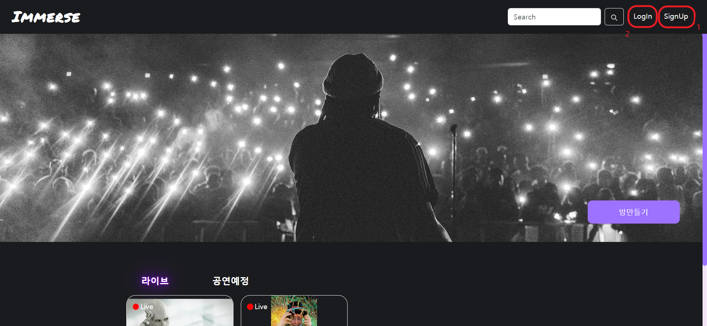

회원가입 페이지로 이동하면 계정 생성에 필요한 값들을 입력해야 합니다. 특히 이메일과 별명은 중복체크를 하지 않으면 계정 생성 버튼이 활성화되지 않습니다. 모든 값을 입력하고 `회원가입` 버튼을 누르면 절차가 완료됩니다.

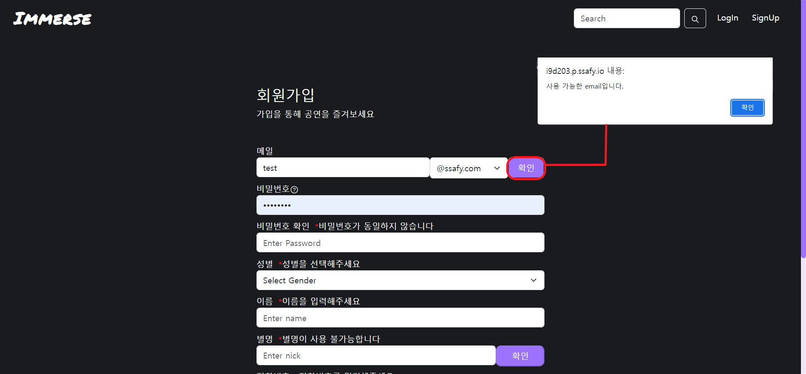

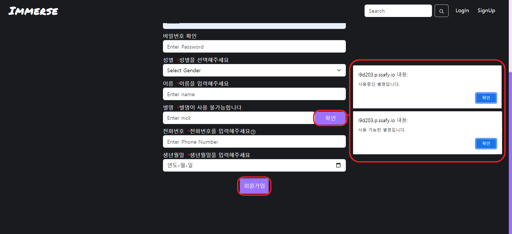

로그인 페이지로 들어갔다면, 이메일과 비밀번호를 입력한 후 로그인 버튼을 눌러 인증합니다. 이메일 형식이 올바르지 않거나 비밀번호 조건이 충분하지 않다면 경고가 표시됩니다.

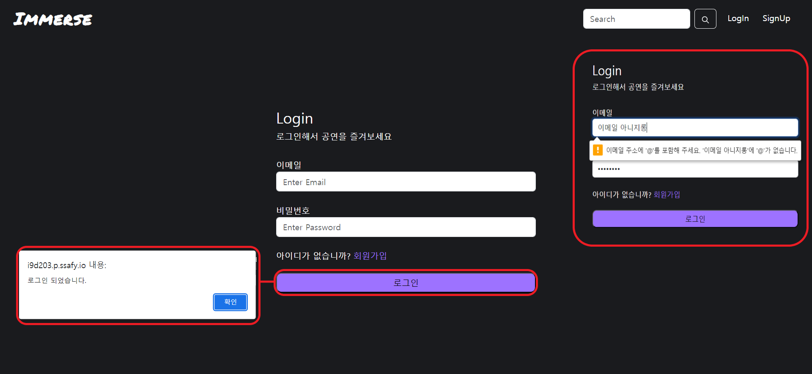

로그인한 후부터는 `Immerse`의 모든 기능을 사용할 수 있습니다. 배너 우측 하단의 `방 만들기` 버튼을 누르면 자신만의 공연 예정을 추가할 수 있습니다(1). 또는 우측 상단의 프로필 이미지를 클릭하여 마이페이지로 넘어갈 수 있습니다(2). 찾으려는 공연 혹은 공연자가 있다면 화면 상단의 검색 기능을 활용할 수도 있습니다(3).

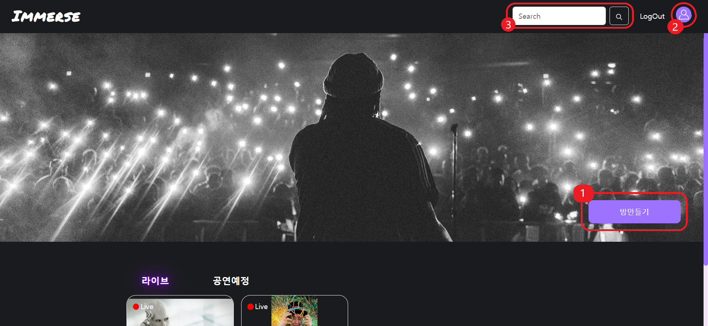

`방 만들기`를 선택하면 공연 예정을 추가하기 위해 필요한 정보를 입력하는 모달창이 표시됩니다.공연 제목, 장르, 공연 설명 등을 입력할 수 있습니다. 공연 썸네일을 추가하여 더 관심을 끌 수도 있습니다. 만일 이미지를 넣지 않으면 공연 장르 별로 기본 이미지가 표시됩니다.

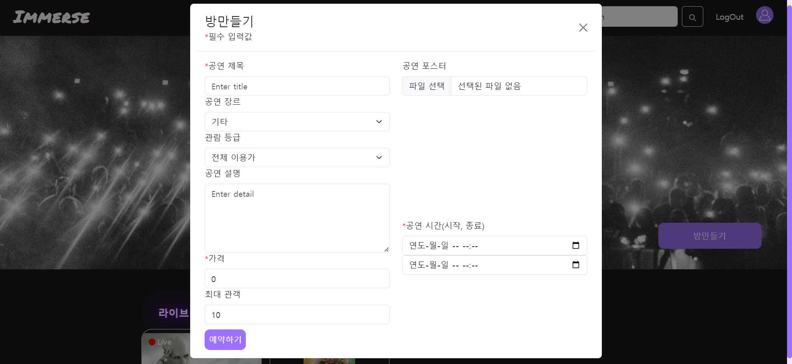

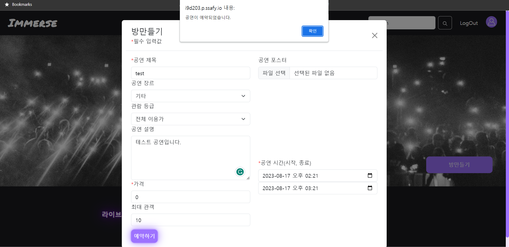

방 만들기에 성공하면 공연 정보 페이지로 이동합니다. `시작하기`를 눌러 언제든 공연을 시작할 수 있습니다.

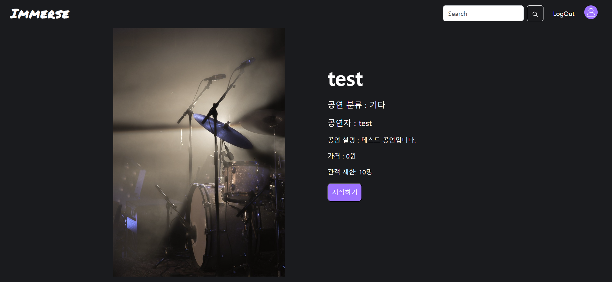

공연자 화면은 좌측에 본인의 화면이 있고, 우측에 관객의 화상이 격자형으로 배치됩니다. 화면이 켜진 동안 공연자는 자신이 원하는 만큼 공연할 수 있습니다. 공연장에서 나갈 때는 자신의 화면 밑의 나가기 버튼을 누르면 됩니다. 공연자가 공연을 나가게 되면 공연은 종료됩니다.

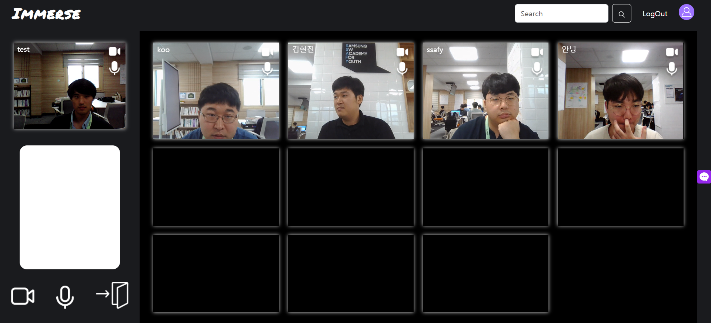

다른 사람이 만들어놓은 공연에 입장할 수도 있습니다. 홈 화면의 하단에서 현재 진행중인 공연 및 예정된 공연을 확인할 수 있습니다. 예정된 공연은 예약할 수 있고, 진행중인 공연에는 입장할 수 있습니다.

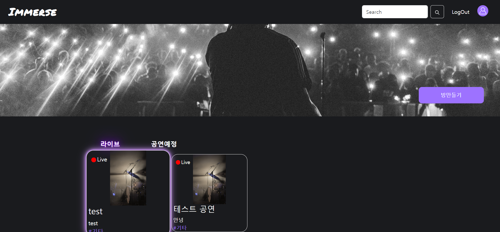

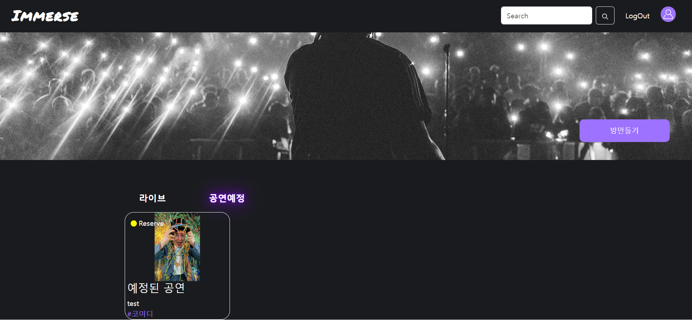

다른 사람이 만든 공연 정보 페이지에 들어가면 진행중인 공연은 `입장하기`, 예정된 공연은 `예약하기` 버튼이 활성화됩니다. 공연에 입장하면 관객 페이지로 넘어갑니다. `예약하기` 버튼을 누르면 해당 공연이 예약 목록에 추가됩니다. 추가된 예약은 프로필 페이지에서 확인 가능합니다.

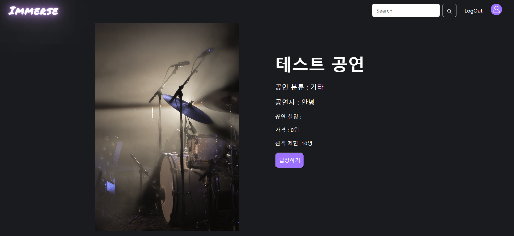

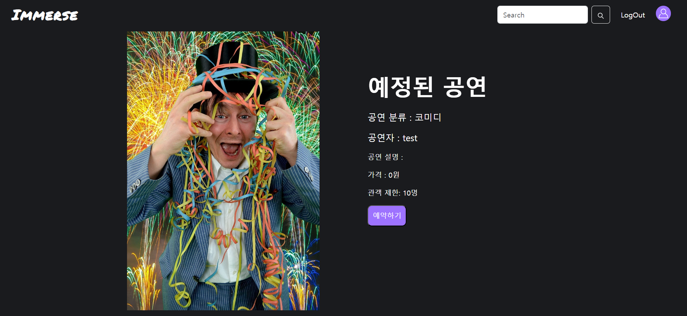

관객 측 공연 화면은 가운데에 공연자의 영상이 있고, 주위로 관객의 영상이 배치되어 있습니다. 관객은 이 화면에서 채팅을 남기거나, 특정 반응으로 자신의 화면을 대체하여 호응하는 이펙트 기능을 사용할 수 있습니다. 채팅 버튼은 우측 가운데에 있습니다(1). 이펙트 기능은 메뉴 바에서 선택할 수 있습니다. 메뉴 바를 열기 위해서는 좌측 하단의 톱니바퀴 버튼을 누르면 됩니다(2).

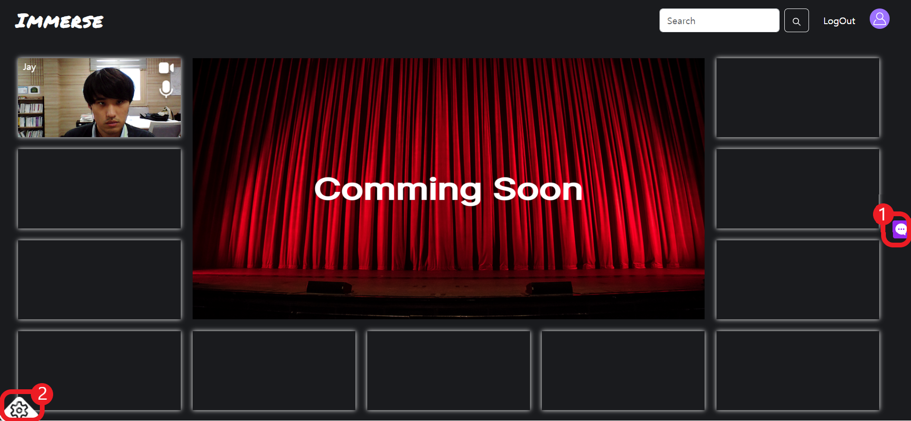

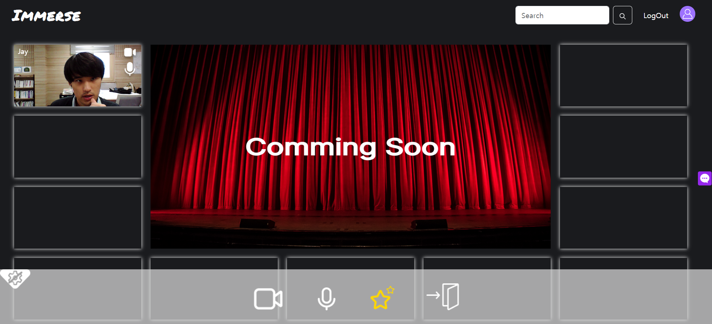

다양한 이펙트를 사용하여 호응할 수 있습니다.

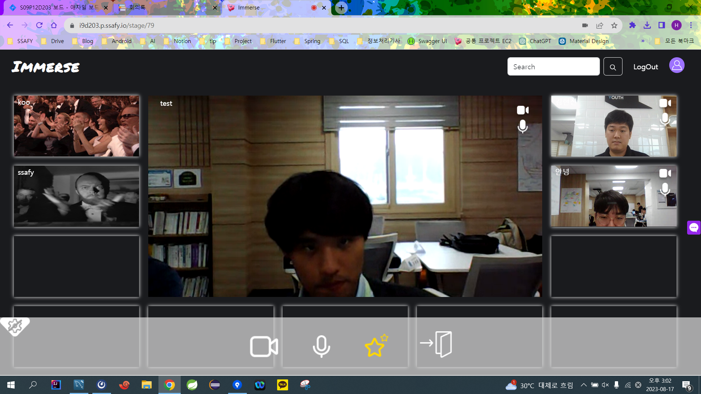

홈 화면 상단의 검색창에 특정 키워드를 검색하면 해당 키워드를 포함하는 공연이나 유저를 찾을 수 있습니다.

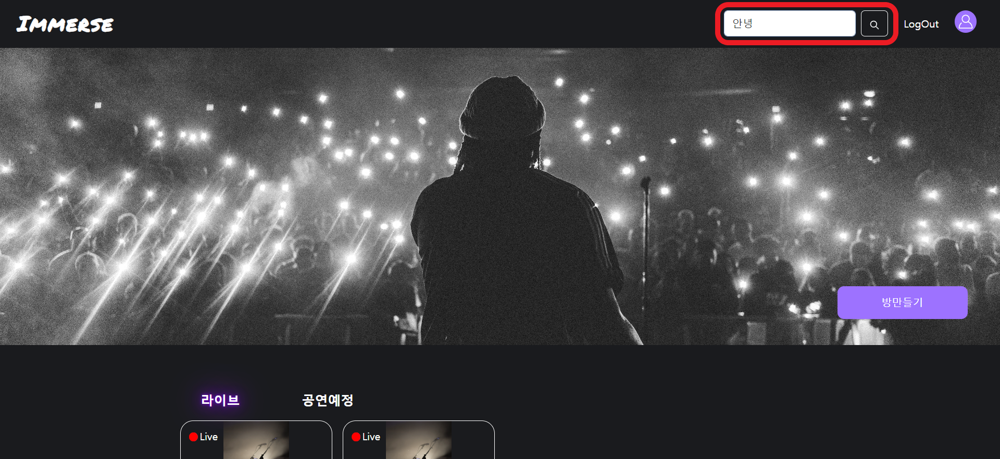

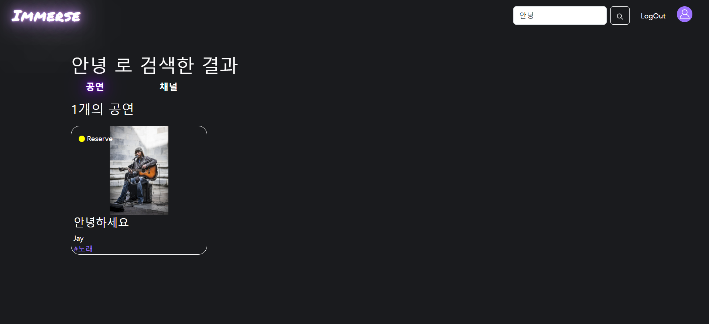

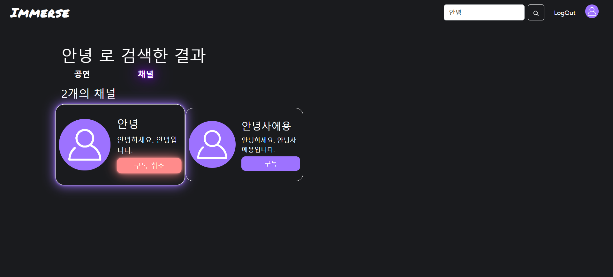

